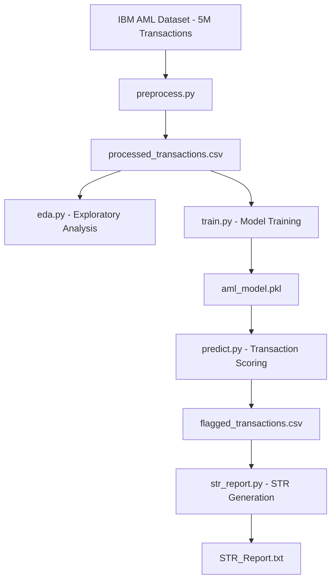

# AML/CFT Transaction Flagging System
 
## 1. Overview
An end-to-end Anti-Money Laundering (AML) and Counter-Financing of Terrorism (CFT) transaction flagging system built on IBM's synthetic financial dataset of 5M+ transactions. The system uses machine learning to detect suspicious financial activity, assigns severity levels based on FATF typologies, and auto-generates Suspicious Transaction Reports (STR) for compliance review.
 
---
 
## 2. Tech Stack
 
### Machine Learning
* Scikit-learn
* Random Forest Classifier
* Isolation Forest
* SMOTE (Imbalanced-learn)
### Data Processing
* Python
* Pandas
* NumPy
### Reporting
* Joblib (model persistence)
* Python datetime
### Version Control
* Git
* GitHub
---
 
## 3. Problem Statement
Financial institutions process millions of transactions daily, making manual AML compliance monitoring infeasible. Traditional rule-based systems produce high false positive rates. This system applies supervised machine learning to flag suspicious transactions with severity scoring aligned to FATF AML/CFT typologies, enabling automated STR generation for compliance teams.
 
---
 
## 4. System Architecture
 

 
---
 
## 5. Repository Structure
 
```text
AML_FLAGGING_SYSTEM/
├── preprocess.py         # Data loading, cleaning, feature engineering
├── eda.py                # Exploratory data analysis
├── train.py              # Model training with SMOTE balancing
├── predict.py            # Transaction prediction and flagging
├── str_report.py         # Severity scoring and STR report generation
├── processed_transactions.csv
├── flagged_transactions.csv
├── aml_model.pkl
└── STR_Report.txt
```
 
---
 
## 6. How to Run
 
### Prerequisites
```bash
pip install pandas scikit-learn imbalanced-learn joblib matplotlib
```
 
### Step 1: Preprocess
```bash
python3 preprocess.py
```
 
### Step 2: EDA
```bash
python3 eda.py
```
 
### Step 3: Train
```bash
python3 train.py
```
 
### Step 4: Predict
```bash
python3 predict.py
```
 
### Step 5: Generate STR Report
```bash
python3 str_report.py
```
 
---
 
## 7. Key Features
* ML-based suspicious transaction detection on 5M+ records
* SMOTE oversampling to handle severe class imbalance (0.1% laundering rate)
* Severity classification — HIGH / MEDIUM / LOW based on FATF typologies
* Automated STR (Suspicious Transaction Report) generation
* Detection of structuring, cross-currency layering, and high-risk payment formats
---
 
## 8. Model Performance
 
| Metric | Legitimate (0) | Laundering (1) |
|--------|---------------|----------------|
| Precision | 1.00 | 0.14 |
| Recall | 1.00 | 0.32 |
| F1-Score | 1.00 | 0.19 |
 
* Total transactions audited: 5,078,345
* Total flagged as suspicious: 6,214
* Severity breakdown: HIGH: 107 | MEDIUM: 2,581 | LOW: 3,526
---
 
## 9. Dataset
IBM Synthetic AML Dataset — [Kaggle](https://www.kaggle.com/datasets/ealtman2019/ibm-transactions-for-anti-money-laundering-aml)
 
Synthetic financial transaction data modelling the full AML cycle: Placement → Layering → Integration. Contains labelled laundering and legitimate transactions across multiple banks, currencies, and payment formats.
 
---
 
## 10. Compliance Framework
Severity scoring aligned to:
* **FATF Recommendations** — international AML/CFT standards
* **PMLA 2002** — Prevention of Money Laundering Act (India)
* **RBI AML Guidelines** — Reserve Bank of India compliance framework

